<p align="center">

</p>

---

# 🚀 About Me

```yaml
Name: Harish Sonwale

Education:
  B.Tech Computer Science Engineering

Location:
  Pune, Maharashtra 🇮🇳

Interested In:
  - Cloud Computing
  - Linux Administration
  - DevOps
  - Networking
  - Artificial Intelligence

Currently Working On:
  FactoryAI
  RAG Applications
  Cloud Automation

Learning:
  Kubernetes
  Terraform
  CI/CD
  Docker
  AWS

Open To:
  Cloud Engineer
  DevOps Engineer
  Linux Administrator
  Network Engineer
```

---

# 🌐 Connect with Me

<p align="left">

<a href="https://www.linkedin.com/in/harish-sonwale/">

</a>

<a href="mailto:harishsonwale4@gmail.com">

</a>

<a href="https://github.com/Harish2004-sonwale">

</a>

</p>

---

# 💻 Tech Stack

<p align="center">


</p>

---

# ☁️ Cloud & DevOps

<p align="center">


</p>

---

# 🌐 Networking

<p align="center">


</p>

---

# 🤖 AI Stack

<p align="center">


</p>

---

# 📊 GitHub Statistics

<p align="center">


</p>

---

# 🔥 GitHub Streak

<p align="center">


</p>

---

# 📈 Contribution Graph

<p align="center">


</p>

---

# 🏆 GitHub Trophy

<p align="center">


</p>

---

# 🚀 Featured Projects

<p align="center">

</p>

---

# 🎓 Certifications

🏅 Aviatrix Multi Cloud Certified Engineer

🏅 Oracle Cloud Infrastructure Foundations Associate

🏅 Agentic AI Foundations Associate

---

# 📈 Profile Views

<p align="center">


</p>

---

# ⚡ Random Dev Quote

<p align="center">


</p>

---

# 🐍 Contribution Snake

<p align="center">


</p>

---

<p align="center">

⭐ Thanks for visiting my profile!

</p>
