<!-- Hero Banner -->

---

<!-- System Init Code Block -->

---

# 🌐 Connect with Me

---

<!-- Tech Arsenal -->

---

<!-- Cloud Architecture -->

---

<!-- Education Timeline -->

---

# 📊 GitHub Statistics

---

# 🔥 GitHub Streak

---

# 📈 Contribution Graph

---

# 🏆 GitHub Trophy

---

# 🚀 Featured Projects

---

<!-- Certifications Header -->

🏅 Aviatrix Multi Cloud Certified Engineer

🏅 Oracle Cloud Infrastructure Foundations Associate

🏅 Agentic AI Foundations Associate

---

# 📈 Profile Views

---

# ⚡ Random Dev Quote

---

# 🐍 Contribution Snake

---

<!-- Footer -->

